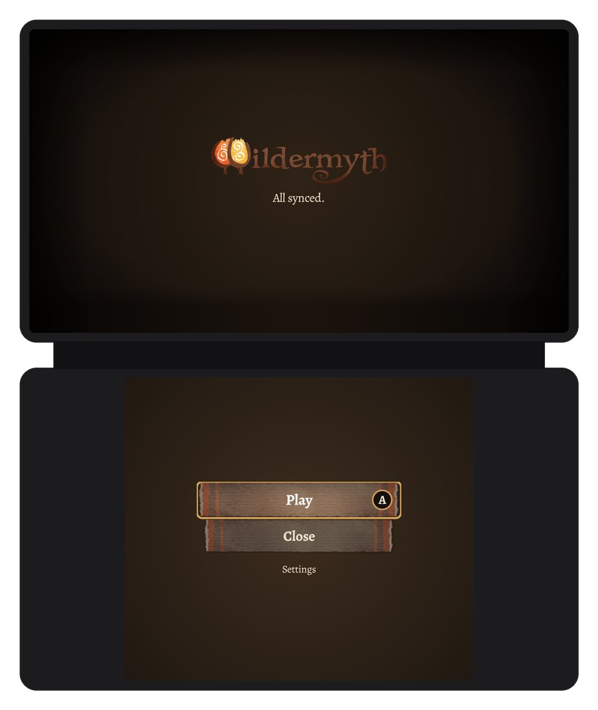
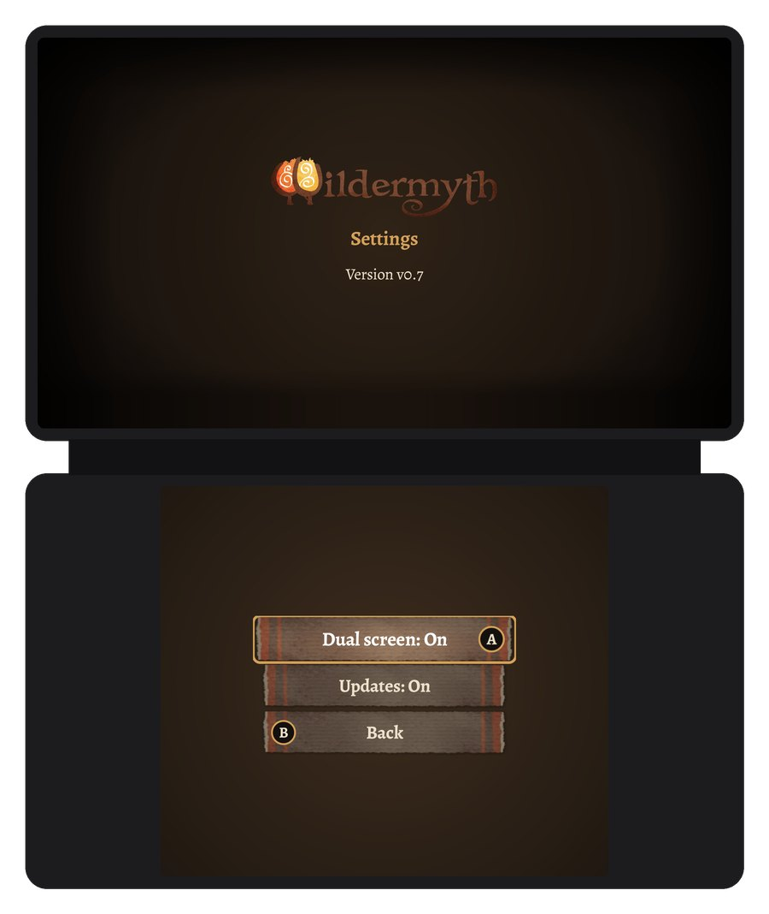

# Dual screen

October 2026 · v0.3 to v0.8

On a handheld with two screens, like the AYN Thor, the map takes the whole top screen and the game's hero
panels move to the bottom screen. The controller still plays the game. The bottom screen is for touch.

Turn it on with "Dual screen" in the launcher's Settings.

## On the campaign map

- **Hero sheet.** Abilities, gear, stats, combat, relationships and aspects, one at a time. Pick one from
  the menu at the top. Tap an entry for details.
- **Hero card.** Tap the hero's name to drop down their card.
- **Tiles.** Select a tile, site or threat and its card replaces the sheet.
- **Overview map.** Terrain, fog of war, threats and your parties, with a frame for what the top screen
  shows. Pinch to zoom, drag to pan, tap a tile to move the camera there.
- **Threats and the message log** open over the bottom screen with the buttons at the top.
- During story events the bottom screen shows the game's logo.

| Hero card | Tile | Overview map |
|---|---|---|
|  |  |  |

## In battle

- **Info** shows the card for whatever the cursor points at, for any action. **Sheet** shows the selected
  hero's sheet.
- Undo and Retreat sit above the heroes.
- Threats lists the foes over the card.
- Healing effects play on the portraits on the bottom screen.

| Info | Sheet | Threats |
|---|---|---|
|  |  |  |

## In the launcher

From v0.8 the launcher's buttons are on the bottom screen too. Tap them, or use the D-pad and A. B goes back.
Settings has the app's version, an update button when there's a new release, and the Dual screen and Updates
switches.

| Launcher | Settings |
|---|---|
|  |  |

## Limits

- Only tested on the AYN Thor.
- The game's own windows (story events, menus, the full character sheet) stay on the top screen.
